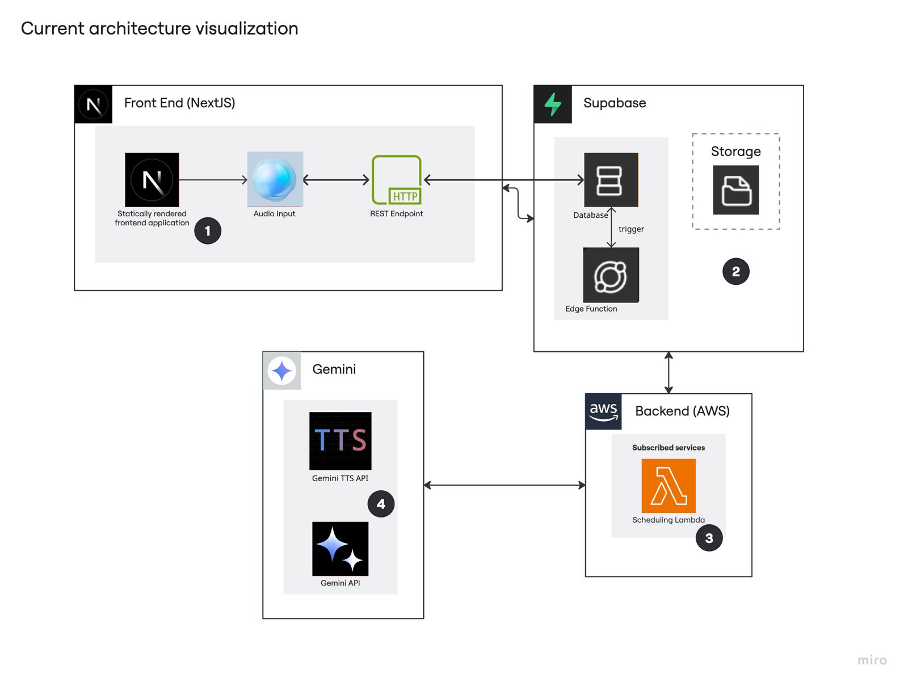
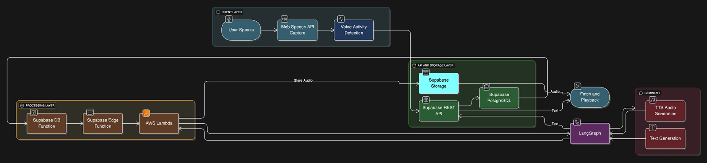
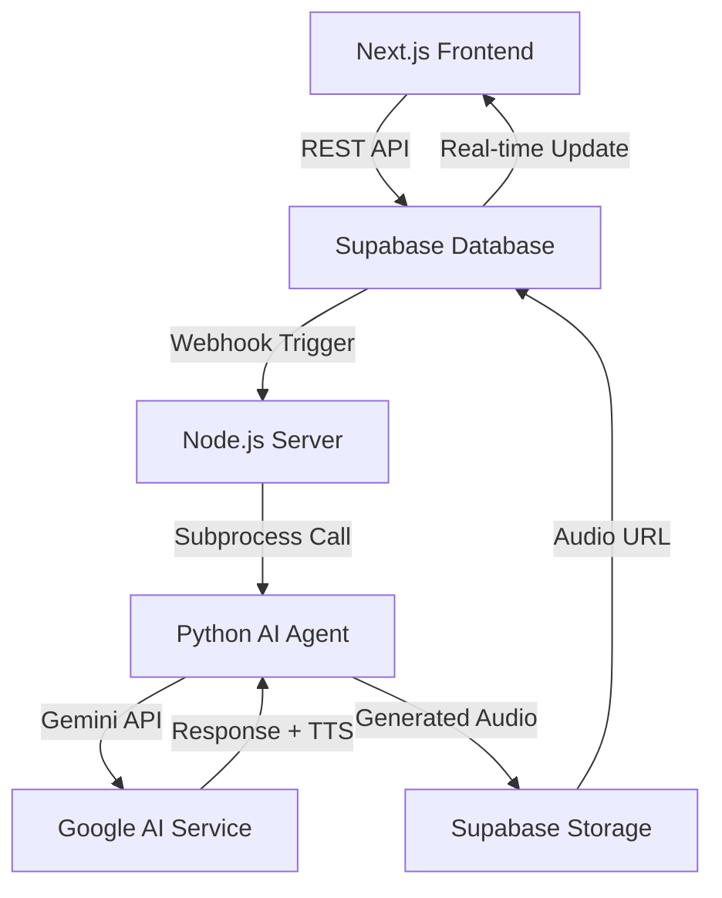

# 🤖 Real-time Agentic Study Buddy System

<div align="center">


</div>

## 🚀 Overview

A cutting-edge **real-time agentic study buddy system** that revolutionizes educational AI by combining advanced conversational AI with adaptive learning capabilities. This system provides personalized tutoring experiences through intelligent voice and text interactions, making learning more engaging and effective.

## 🎯 Problem Statement

### Current Educational AI Challenges
- **Limited Personalization**: Generic responses that don't adapt to individual learning styles
- **Poor Engagement**: Static Q&A format without interactive learning experiences
- **No Progress Tracking**: Lack of learning analytics and mastery assessment
- **Scalability Issues**: Unable to handle multiple concurrent learners effectively

### Technical Pain Points
- ❌ **Non-Adaptive Systems**: One-size-fits-all approach to education
- ❌ **Limited Interaction**: Text-only interfaces without voice capabilities
- ❌ **No Learning Context**: Sessions don't build on previous conversations
- ❌ **Poor Assessment**: No real-time understanding evaluation

## 💡 Solution

### 🌟 Key Features
- 🧠 **Adaptive Learning**: AI adjusts teaching style based on student comprehension
- 🎙️ **Voice + Text Interaction**: Multi-modal communication for better engagement
- 📊 **Real-time Assessment**: Continuous evaluation with personalized quizzes
- 🔄 **Contextual Memory**: Builds on previous learning sessions
- ⚡ **Ultra-fast Responses**: ~1-2 second response time
- 📱 **Multi-platform**: Works on web, mobile, and desktop
- 🎯 **Subject Agnostic**: Supports math, science, history, literature, and more

### 🏗️ Architecture Flow
```
📱 Frontend (Next.js) → 🌐 REST API → 🗄️ Supabase DB → 🔔 Webhook Trigger
                                                              ↓
🎵 Audio Response ← 🔊 TTS Generation ← 🤖 Python AI Agent ← 📨 Node.js Server
```

## 🛠️ Technical Stack

<div align="center">

### Frontend


### Backend


### AI & ML


### Database & Storage


### DevOps & Tools


</div>

## 🏗️ System Architecture

### Architecture Overview


### Data Flow Diagram


### Technical Flow


## 🚀 Getting Started

### Prerequisites
- **Node.js** 18+ 
- **Python** 3.9+
- **Git**
- **Supabase Account**
- **Google Cloud Account** (Gemini API access)
- **ngrok** (for webhook tunneling)

### 📦 Installation

1. **Clone the repository**
   ```bash
   git clone https://github.com/AnshAggr1303/Agentic-Chatbot-System.git
   cd Agentic-Chatbot-System
   ```

2. **Install Frontend Dependencies**
   ```bash
   npm install
   # or
   yarn install
   ```

3. **Install Backend Dependencies**
   ```bash
   cd chatbot-server
   npm install
   pip install -r requirements.txt  # If requirements.txt exists
   # or install individual packages:
   pip install google-generativeai python-dotenv
   ```

4. **Environment Setup**

   **Root `.env` file:**
   ```bash
   cp .env.example .env
   ```
   ```env
   # Frontend Environment Variables
   NEXT_PUBLIC_SUPABASE_URL=your_supabase_project_url
   NEXT_PUBLIC_SUPABASE_ANON_KEY=your_supabase_anon_key
   ```

   **Backend `chatbot-server/.env` file:**
   ```env
   # Google Gemini API Keys (Multiple keys for load balancing)
   GOOGLE_API_KEY_1=your_first_google_api_key
   GOOGLE_API_KEY_2=your_second_google_api_key
   GOOGLE_API_KEY_3=your_third_google_api_key
   GOOGLE_API_KEY_4=your_fourth_google_api_key
   GOOGLE_API_KEY_5=your_fifth_google_api_key
   GOOGLE_API_KEY_6=your_sixth_google_api_key
   GOOGLE_API_KEY_7=your_seventh_google_api_key
   
   # Alternative: Single API Key
   # GOOGLE_API_KEY=your_single_google_api_key
   
   # Supabase Configuration
   SUPABASE_URL=your_supabase_project_url
   SUPABASE_ANON_KEY=your_supabase_anon_key
   
   # Server Configuration
   PORT=3002
   NODE_ENV=development
   ```

5. **Database Setup**
   - Create a new Supabase project
   - Set up the required tables and webhooks
   - Configure row-level security policies

### 🏃‍♂️ Running the Application

1. **Start the Backend Server**
   ```bash
   cd chatbot-server
   node index.js
   ```
   Server will start on `http://localhost:3002`

2. **Set up ngrok tunnel (Required for webhooks)**
   ```bash
   # In a new terminal
   ngrok http 3002
   ```
   Copy the HTTPS URL (e.g., `https://abc123.ngrok.io`)

3. **Configure Supabase Webhook**
   - Go to your Supabase project dashboard
   - Navigate to Database > Webhooks
   - Create a new webhook pointing to: `https://your-ngrok-url.ngrok.io/webhook/chat-message`

4. **Start the Frontend**
   ```bash
   # In the root directory
   npm run dev
   ```
   Frontend will be available at `http://localhost:3000`

## 📁 Project Structure

```
Agentic-Chatbot-System/
├── 📁 app/                    # Next.js app directory
├── 📁 components/             # React components
├── 📁 hooks/                  # Custom React hooks  
├── 📁 lib/                    # Utility functions
├── 📁 types/                  # TypeScript definitions
├── 📁 public/                 # Static assets
├── 📁 assets/                 # Project assets
├── 📁 chatbot-server/         # Backend server
│   ├── 📄 index.js           # Express server
│   ├── 📄 func.py            # AI agent logic
│   ├── 📄 package.json       # Node.js dependencies
│   ├── 📁 uploads/           # Temporary file storage
│   └── 📄 .env               # Backend environment variables
├── 📄 .env                    # Frontend environment variables
├── 📄 package.json            # Frontend dependencies
├── 📄 .gitignore             # Git ignore rules
└── 📄 README.md              # This file
```

## 🤖 Agentic AI Features

### 🧠 Intelligent Teaching Phases
1. **Analysis Phase**: Assesses student level and learning style
2. **Teaching Phase**: Delivers personalized explanations with examples
3. **Assessment Phase**: Tests understanding with adaptive questions
4. **Next Steps Phase**: Recommends follow-up topics and study paths

### 🎯 Adaptive Capabilities
- **Learning Style Detection**: Visual, auditory, kinesthetic, reading preferences
- **Difficulty Adjustment**: Automatically scales complexity based on performance
- **Subject Recognition**: Identifies math, science, history, literature topics
- **Progress Tracking**: Monitors mastery levels and learning progression

### 🔧 Technical Features
- **Multi-model Support**: Gemini 2.0 Flash, 2.5 Flash Preview
- **API Key Rotation**: Automatic failover across multiple API keys
- **Structured Responses**: JSON-based data for consistent interactions
- **Voice Generation**: Text-to-speech with multiple voice options

## 🧪 Testing & Development

### Test the Backend API
```bash
# Test Python integration
curl -X POST http://localhost:3002/debug/test-python \
  -H "Content-Type: application/json" \
  -d '{"message": "Explain photosynthesis", "messageType": "text"}'

# Check database schema
curl http://localhost:3002/debug/test-db-schema
```

### Health Check
```bash
curl http://localhost:3002/health
```

## 📊 Performance Metrics

- **Response Time**: 1-2 seconds average
- **Concurrent Users**: 100+ supported
- **Voice Recognition**: 95%+ accuracy  
- **Learning Adaptation**: Real-time difficulty adjustment
- **API Reliability**: Multiple key rotation system

## 🔒 Security Features

- ✅ **Environment Variables**: All sensitive keys stored securely
- ✅ **API Key Rotation**: Automatic failover prevents rate limiting
- ✅ **Input Validation**: Sanitized user inputs
- ✅ **HTTPS Required**: Secure webhook communication
- ✅ **Row Level Security**: Supabase database protection

## 📈 Monitoring & Analytics

- **Real-time Metrics**: Response times, success rates
- **Learning Analytics**: Student progress, mastery levels
- **Error Tracking**: Comprehensive logging system
- **Performance Monitoring**: API usage and rate limit tracking

## 🤝 Contributing

1. Fork the repository
2. Create a feature branch (`git checkout -b feature/amazing-feature`)
3. Commit your changes (`git commit -m 'Add amazing feature'`)
4. Push to the branch (`git push origin feature/amazing-feature`)
5. Open a Pull Request

## 🆘 Troubleshooting

### Common Issues

**Webhook not triggering?**
- Check ngrok is running and URL is correct in Supabase
- Verify webhook endpoint: `/webhook/chat-message`

**API Key errors?**
- Ensure all Google API keys are valid
- Check quota limits in Google Cloud Console

**Audio not generating?**
- Verify file permissions in `uploads/` directory
- Check Supabase storage bucket configuration

## 📝 License

This project is licensed under the MIT License - see the [LICENSE](LICENSE) file for details.

## 🙋‍♂️ Support & Contact

- **🐛 Issues**: [GitHub Issues](https://github.com/AnshAggr1303/Agentic-Chatbot-System/issues)
- **💬 Discussions**: [GitHub Discussions](https://github.com/AnshAggr1303/Agentic-Chatbot-System/discussions)
- **📧 Email**: anshagrawal148@gmail.com

## 🎉 Acknowledgments

- **Google Gemini Team** for powerful AI capabilities
- **Supabase Team** for seamless backend infrastructure  
- **Next.js Team** for the amazing React framework
- **Open Source Community** for inspiration and tools

---

<div align="center">

**🚀 Built with ❤️ by [Ansh Aggarwal](https://github.com/AnshAggr1303) and [Yash Dagar](https://github.com/yashdagar)**

⭐ **Star this repository if you found it helpful!** ⭐

</div>